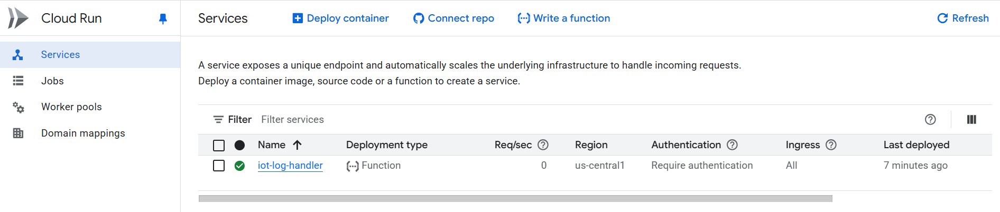
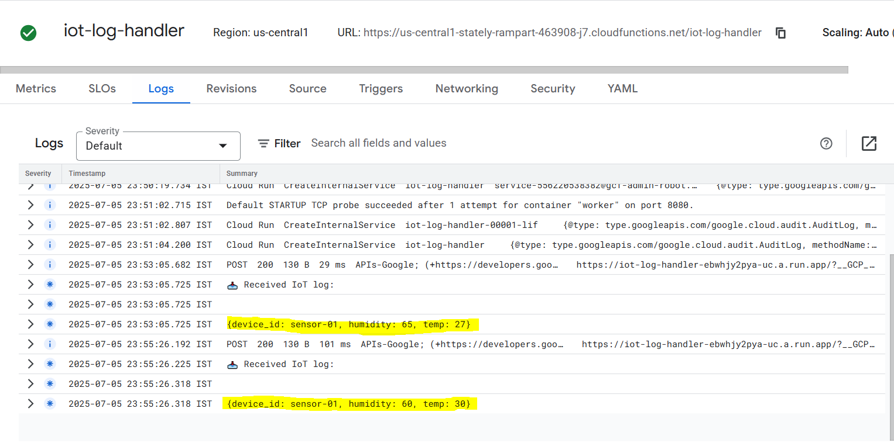

# 📡 IoT Log Analyzer – GCP Serverless Project


---

## 🧠 About the Project

This project is a **real-time log processing system** designed using **Google Cloud Pub/Sub** and **Cloud Functions (2nd Gen)**. It simulates an IoT environment where device logs are streamed into a Pub/Sub topic and processed by a Cloud Function.

Use Cases:
- Real-time log analysis for IoT/Edge devices
- Smart monitoring pipelines
- Serverless alerting system foundations

---

## 🛠️ Tech Stack

- **Google Cloud Pub/Sub** – for streaming IoT logs
- **Cloud Functions (Python)** – serverless log handler
- **Cloud Shell + Bash** – infrastructure automation
- **IAM, API activation** – permission & service control

---

## 📂 Project Structure

```bash
iot-log-analyzer/
├── main.py              # Cloud Function code
├── requirements.txt     # Python dependencies
├── deploy.sh            # Automated deployment script
├── screenshot.png       # Terminal proof of working setup
└── README.md            # This documentation
---

## 📜 Function Logic (main.py)

```python
def iot_log_handler(event, context):
    import base64
    import logging
    message = base64.b64decode(event['data']).decode('utf-8')
    logging.info(f"📥 IoT Log Received: {message}")
```

---

## 📦 Deploy Using Shell

```bash
chmod +x deploy.sh
./deploy.sh
```

The script:
- Creates a Pub/Sub topic named `iot-device-logs`.
- Deploys the `iot_log_handler` function (2nd Gen).
- Binds the Cloud Function to trigger on each message.

---

## ✅ Deployment Output

- Cloud Function Name: `iot-log-handler`
- Trigger Type: Pub/Sub topic message
- Runtime: Python 3.11
- Region: `us-central1`
- Execution Log: View in **Cloud Logging** (Log Explorer)

---

## 🖼️ Screenshot

📸 Terminal showing VM/IP or successful function deployment:




---

## 🧪 Test the System

Publish a test message:
```bash
gcloud pubsub topics publish iot-device-logs --message="Sensor 42: Temp=36.7C"
```

Then check logs:
```bash
gcloud logging read "resource.type=cloud_function AND resource.labels.function_name=iot-log-handler" --limit=5
```

---

## 🧠 Interview Talking Points

| Error Faced | Solution |
|-------------|----------|
| `Resource already exists` | Pub/Sub topic already created from earlier run. Handled by ignoring the duplicate error. |
| `PERMISSION_DENIED for Cloud Build` | Enabled `cloudbuild.googleapis.com` and retried. |
| `Eventarc API not enabled` | Activated `eventarc.googleapis.com` via console. |
| `URL not working` | Cloud Function is event-triggered by Pub/Sub, not HTTP-invoked. |

---

## 📚 Learning Outcome

- Built a **serverless event-driven pipeline**
- Integrated **Pub/Sub + Cloud Functions**
- Debugged real GCP deployment errors
- Used **Cloud Shell + gcloud CLI** for deployment

---

## 📄 License

[](LICENSE)

---

🌐 Author
Kshitija Randive
🔗 GitHub | 🌐 Portfolio
